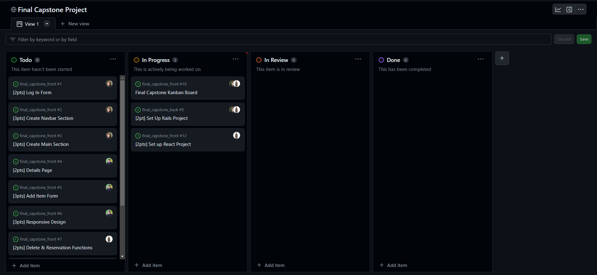
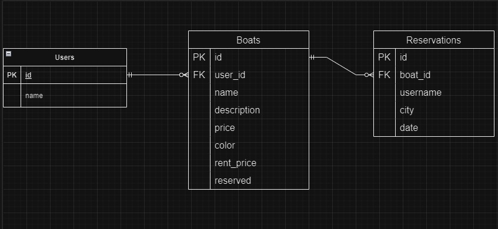

<a name="readme-top"></a>
<div align="center">

  <h1><b>Reserve Boats</b></h1>

</div>

<!-- TABLE OF CONTENTS -->

# 📗 Table of Contents

- [📗 Table of Contents](#-table-of-contents)
- [📖 Final Capstone Project Backend ](#-final-capstone-project-backend-)
  - [🛠 Built With ](#-built-with-)
    - [Tech Stack ](#tech-stack-)
    - [Key Features ](#key-features-)
  - [🚀 Front End Part ](#-front-end-part-)
  - [🚀 Kanban Board ](#-kanban-board-)
  - [🚀 ERD ](#-erd-)
  - [💻 Getting Started ](#-getting-started-)
    - [Prerequisites](#prerequisites)
    - [Setup](#setup)
    - [Install](#install)
    - [Usage](#usage)
  - [👥 Authors ](#-authors-)
  - [🔭 Future Features ](#-future-features-)
  - [🤝 Contributing ](#-contributing-)
  - [⭐️ Show your support ](#️-show-your-support-)
  - [🙏 Acknowledgments ](#-acknowledgments-)
  - [📝 License ](#-license-)

<!-- PROJECT DESCRIPTION -->

# 📖 Final Capstone Project Backend <a name="about-project"></a>

**Reserve Boats** is a website made in Ruby on Rails + Postgresql and React + React Router + Redux where after signing up and logging in, you can book a ride in a boat, add a new boat or delete it!

It's an API only RoR project.

## 🛠 Built With <a name="built-with"></a>

### Tech Stack <a name="tech-stack"></a>

<details>
  <summary>Client</summary>
  <ul>
    <li><a href="https://es.react.dev/">React</a></li>
  </ul>
</details>


<details>
  <summary>Server</summary>
  <ul>
    <li><a href="https://rubyonrails.org/">Ruby on Rails</a></li>
  </ul>
</details>

<details>
<summary>Database</summary>
  <ul>
    <li><a href="https://www.postgresql.org/">PostgreSQL</a></li>
  </ul>
</details>

<!-- Features -->

### Key Features <a name="key-features"></a>

- **API only RoR**
- **Postgresql database**

<p align="right">(<a href="#readme-top">back to top</a>)</p>

<!-- FRONT END PART -->

## 🚀 Front End Part <a name="front-end-part"></a>

The site has 2 separate repositories, this is the Frontend repository.

Link to the [Front End Repository](https://github.com/Felipe-Perez-Ferraro/final_capstone_front)

<p align="right">(<a href="#readme-top">back to top</a>)</p>

<!-- KANBAN BOARD -->

## 🚀 Kanban Board <a name="front-end-part"></a>

Link for the [Kanban Board](https://github.com/users/Felipe-Perez-Ferraro/projects/2/views/1)



The 3 team members:

- Ulises Cappa: @ulises2607 
- Hajnalka Oltyan: @hajnaloltyan 
- Felipe Perez Ferraro: @Felipe-Perez-Ferraro 

<p align="right">(<a href="#readme-top">back to top</a>)</p>

<!-- ERD -->

## 🚀 ERD <a name="front-end-part"></a>



<p align="right">(<a href="#readme-top">back to top</a>)</p>

<!-- GETTING STARTED -->

## 💻 Getting Started <a name="getting-started"></a>

To get a local copy up and running, follow these steps.

### Prerequisites

In order to run this project you need:

```sh
 gem install rails
```

### Setup

Clone this repository to your desired folder:

```sh
  cd my-folder
  git clone https://github.com/Felipe-Perez-Ferraro/final_capstone_back
```

### Install

Install this project with:

```sh
  cd my-project
  bundle install
```

### Usage

To run the project, execute the following command:

```sh
  rails db:create
  rails db:migrate
  rails server
```

Link for the API Documentation: http://127.0.0.1:3001/api-docs/index.html 

<p align="right">(<a href="#readme-top">back to top</a>)</p>

<!-- AUTHORS -->

## 👥 Authors <a name="authors"></a>

👤 **Felipe Perez Ferraro**

- GitHub: [@githubhandle](https://github.com/Felipe-Perez-Ferraro)
- LinkedIn: [LinkedIn](https://www.linkedin.com/in/felipe-perez-ferraro-6b9358218/)

👤 **Ulises Cappa**

- GitHub: [@ulises2607](https://github.com/ulises2607)
- LinkedIn: [Cesar Ulises Cappa Subelza](https://www.linkedin.com/in/cesar-ulises-cappa-subelza/)

👤 **Hajnalka Oltyan**

- GitHub: [@hajnaloltyan](https://github.com/hajnaloltyan)
- LinkedIn: [Hajnal Oltyan](https://www.linkedin.com/in/hajnaloltyan)

<p align="right">(<a href="#readme-top">back to top</a>)</p>

<!-- FUTURE FEATURES -->

## 🔭 Future Features <a name="future-features"></a>

- [ ] **Edit and Delete a Reservation**

<p align="right">(<a href="#readme-top">back to top</a>)</p>

<!-- CONTRIBUTING -->

## 🤝 Contributing <a name="contributing"></a>

Contributions, issues, and feature requests are welcome!

Feel free to check the [issues page](https://github.com/Felipe-Perez-Ferraro/final_capstone_back/issues).

<p align="right">(<a href="#readme-top">back to top</a>)</p>

<!-- SUPPORT -->

## ⭐️ Show your support <a name="support"></a>

If you like this project please share with your friends and family!

<p align="right">(<a href="#readme-top">back to top</a>)</p>

<!-- ACKNOWLEDGEMENTS -->

## 🙏 Acknowledgments <a name="acknowledgements"></a>

I would like to thank Microverse for teach me and support me to do this.

<p align="right">(<a href="#readme-top">back to top</a>)</p>

<!-- LICENSE -->

## 📝 License <a name="license"></a>

This project is [MIT](./LICENSE) licensed.

<p align="right">(<a href="#readme-top">back to top</a>)</p>
